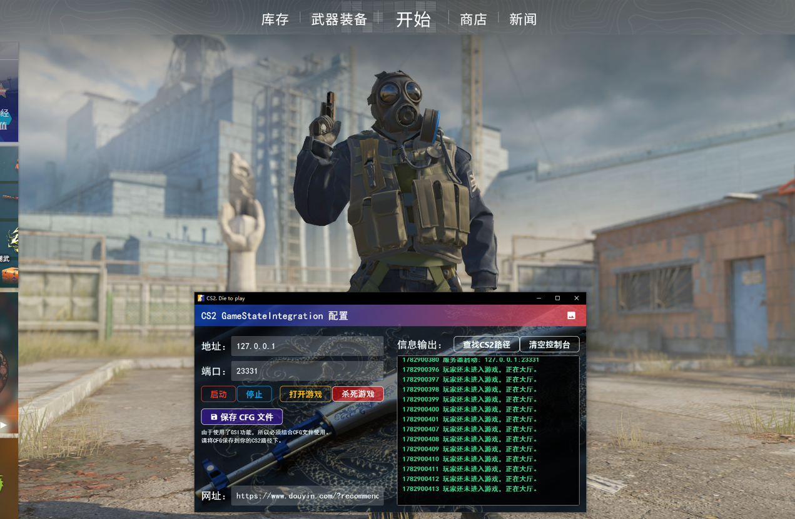

# CS2_Die2Play

游玩CS2时，被击杀即跳转的程序；使用Flutter框架开发，Windows平台。

---

# 预览图



---

教程视频：  
[我制作了一个CS2被击杀就刷抖音的程序 - 哔哩哔哩](https://www.bilibili.com/video/BV1h5Tv6KEHi/)  
[我制作了一个CS2被击杀就刷抖音的程序 - 抖音](https://www.douyin.com/user/self?from_tab_name=main&modal_id=7657501223033015603)

## 手动构建

```bash
git clone git@github.com:sngrotesque/CS2_Die2Play.git

# Flutter
cd CS2_Die2Play
```

### 1. DLL

1. 打开你的Visual Studio，然后打开 `BringToFront\BringToFront.sln` 。
2. 点击菜单栏的“生成 -> Build BringToFront”。
3. 去 `BringToFront\x64\Release` 把得到的 `BringToFront.dll` 放到 Flutter 项目构建出来的根目录中。

### 2. Flutter

1. 获取包和构建
```bash
flutter pub get
flutter build windows --release
```
2. 打开 Flutter 项目构建出来的根目录。
```cmd
start build\windows\x64\runner\Release
```
3. 确保 `BringToFront.dll` 已经放置在 `cs2_die2play.exe` 同级目录中。
4. 运行 `cs2_die2play.exe`。

## 下载

前往 [发布](https://github.com/sngrotesque/CS2_Die2Play/releases) 页面。
